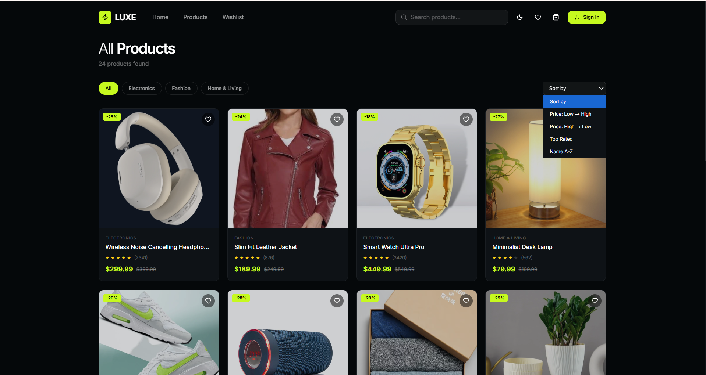
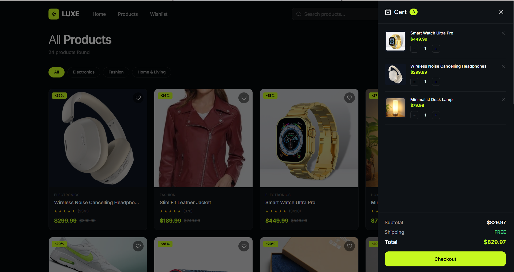
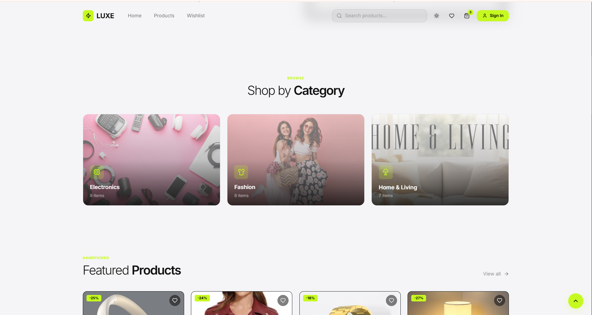
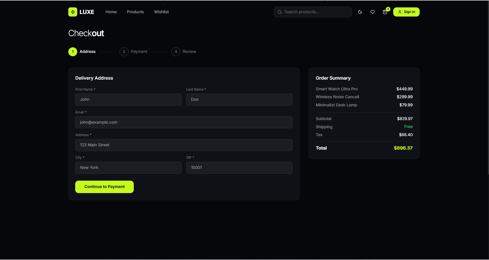

# Ecommerce-Website
Built a modern responsive e-commerce web application with dynamic product listing, product detail pages, cart management, wishlist functionality, authentication system, multi-step checkout flow, search and filtering features, theme switching, and local storage persistence using JavaScript, HTML, Tailwind CSS.

## Screenshots

### Home Page

### Cart Page

### Light Mode

### Checkout Page

# Features
-->Responsive modern UI

-->Product listing and filtering

-->Product search functionality

-->Category-based navigation

-->Product detail pages

-->Wishlist management

-->Shopping cart system

-->Login & Signup modal

-->Password strength validation

-->Dark/Light mode toggle

-->Real-time cart updates

-->LocalStorage data persistence

-->Mobile-friendly navigation

-->Smooth animations and reveal effects

# Technologies Used
==>HTML5

==>CSS

==>Vanilla JavaScript
